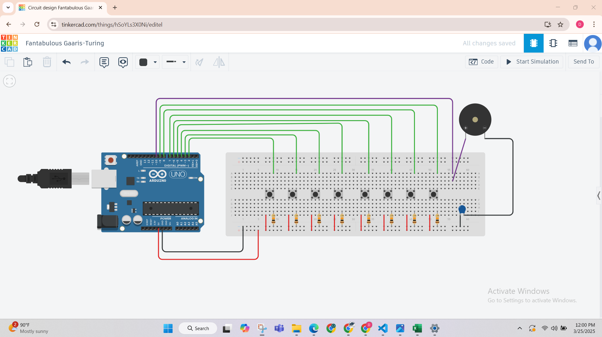

# Task 1: 8-Key Tone Generator using Arduino Uno

## 📝 Task Description
The objective of this task is to build an **8-key tone generator** using an Arduino Uno. Each key (push-button) generates a specific tone through a speaker when pressed. The system detects:
- **Short press (momentary)**: plays the tone for 20ms.
- **Long press (held)**: plays the tone continuously.
- **Multiple keys pressed simultaneously**: the output tone is the **sum of the frequencies** assigned to each pressed key.

---

## 🎯 Key Frequency Assignments
| Key | Frequency |
|-----|-----------|
| 1   | 300 Hz    |
| 2   | 400 Hz    |
| 3   | 500 Hz    |
| 4   | 600 Hz    |
| 5   | 700 Hz    |
| 6   | 800 Hz    |
| 7   | 900 Hz    |
| 8   | 1000 Hz   |

---

## 🔧 Components Used
- Arduino Uno
- 8 Push-button switches
- Resistors (for pull-down configuration)
- Breadboard
- Jumper wires
- Piezo buzzer or speaker

---

## 🔌 Circuit Diagram

> *Simulated using TinkerCAD*

---

## 💻 Code Overview
The sketch reads the state of each button and uses the `tone()` function to output the corresponding frequency to a connected buzzer/speaker. It calculates the **sum** of frequencies when multiple keys are pressed.

📂 Code: [`code.ino`](code_task1.ino)

