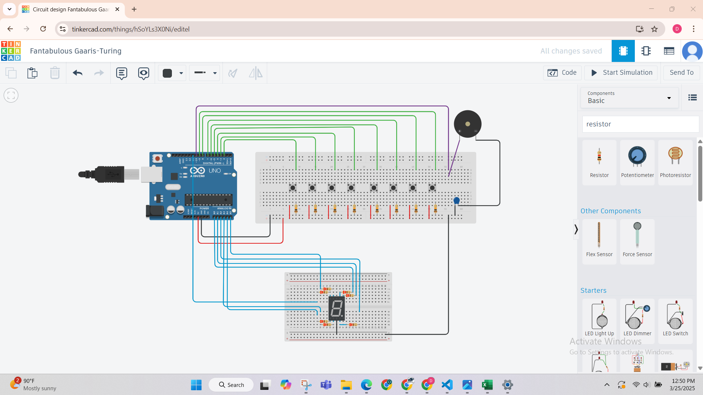

# Task 2: Display Key Number using 7-Segment Display

## 📝 Task Description
In this task, the existing 8-key tone generator circuit is enhanced by adding a **7-segment display**. The goal is to show the **key number** being pressed. If **multiple keys** are pressed at once, the display **alternates between the key numbers every 500 milliseconds**.

---

## 🔧 Additional Components Used
- 1 x Common Cathode 7-Segment Display
- 8 x 220Ω resistors (for segment current limiting)
- Optional: 1 x 74HC595 shift register (to reduce Arduino pin usage)
- Arduino Uno
- Breadboard and jumper wires

---

## 🔌 Circuit Diagram


> *Updated in TinkerCAD with a 7-segment display connected directly or via a shift register*

---

## 💻 Code Overview
The code detects which button(s) are pressed, generates the tone (from Task 1), and then displays the key number(s) using the 7-segment display. If multiple keys are pressed, the numbers alternate every 500ms.

📂 Code: [`code_task2.ino`](code_task2.ino)

### 🔢 Segment Mapping

Example for displaying digits (Common Cathode configuration):

```cpp
const byte digits[10][7] = {
  {1,1,1,1,1,1,0},  // 0
  {0,1,1,0,0,0,0},  // 1
  {1,1,0,1,1,0,1},  // 2
  {1,1,1,1,0,0,1},  // 3
  {0,1,1,0,0,1,1},  // 4
  {1,0,1,1,0,1,1},  // 5
  {1,0,1,1,1,1,1},  // 6
  {1,1,1,0,0,0,0},  // 7
  {1,1,1,1,1,1,1},  // 8
  {1,1,1,1,0,1,1}   // 9
};
